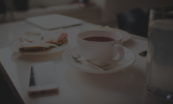

Project or program name

Author name

Description of project

Project setup instructions

Link to live site on GitHub Pages

Copyright and license information

  
Hppy Hour

  
Party Time

#img1
{
margin: 0px 0px 0px 0px;
border: 0px solid #A9A9A9;
float: right;

}
#img2
{
margin: 0px 0px 0px 0px;
border: 0px solid #A9A9A9;
float: right;

}
#img3
{
margin: 0px 0px 0px 0px;
border: 0px solid #A9A9A9;
float: right;
}
.jumbotron-1{

  background-color: #FDFEFE;
  height:5%
  width: 23%;
}
.jumbotron-2{

  background-color: #D35400;
  width: 23%;
  height:5%

}
